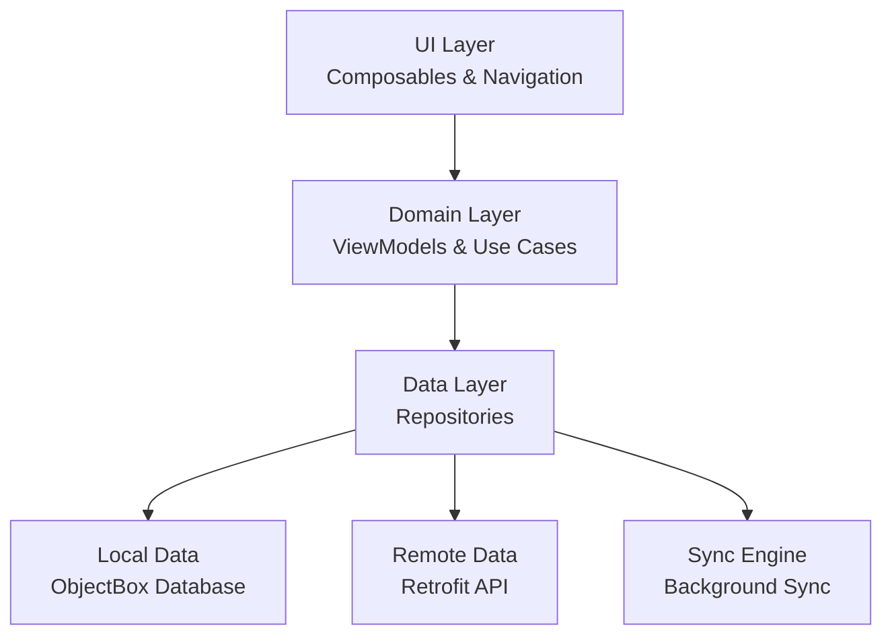

# Architecture Overview

Finsible follows modern Android development best practices with a clean, scalable architecture that separates concerns and enables easy testing and maintenance.

## Architecture Pattern

### MVVM + Repository Pattern



## Layer Breakdown

### 🎨 UI Layer (Presentation)

**Responsibility**: User interface and user interaction

#### Components

-   **Jetpack Compose UI**: Modern declarative UI framework
-   **Navigation**: Screen navigation and deep linking
-   **Themes**: Material Design 3 with custom color system
-   **State Management**: Compose state and lifecycle-aware components

#### Structure

```
ui/
├── components/          # Reusable UI components
├── screens/            # Screen-specific composables
├── navigation/         # Navigation graphs and routes
├── theme/             # Material Design theme configuration
└── utils/             # UI utilities and extensions
```

#### Key Technologies

-   **Jetpack Compose**: Declarative UI
-   **Material Design 3**: Design system
-   **Navigation Compose**: Type-safe navigation
-   **ViewModel**: UI state management

---

### 🧠 Domain Layer (Business Logic)

**Responsibility**: Business logic and use cases

#### Components

-   **ViewModels**: UI state management and business logic coordination
-   **Use Cases**: Single-purpose business operations
-   **Models**: Domain-specific data models
-   **Repositories (Interfaces)**: Data access abstractions

#### Structure

```
domain/
├── model/             # Domain models and entities
├── repository/        # Repository interfaces
├── usecase/          # Business use cases
└── util/             # Domain utilities
```

#### Design Principles

-   **Single Responsibility**: Each use case has one clear purpose
-   **Dependency Inversion**: Depends on abstractions, not implementations
-   **Clean Architecture**: Business logic independent of frameworks

---

### 💾 Data Layer

**Responsibility**: Data access and management

#### Components

-   **Repositories (Implementation)**: Data access coordination
-   **Local Data Sources**: ObjectBox database operations
-   **Remote Data Sources**: API communication
-   **Synchronization**: Offline-first data sync

#### Structure

```
data/
├── di/                # Dependency injection modules
├── local/             # Local data sources
│   ├── entity/            # Database entities
│   ├── dao/              # Data access objects
│   └── database/         # Database configuration
├── remote/            # Remote data sources
│   ├── api/              # API service interfaces
│   ├── dto/              # Data transfer objects
│   └── interceptor/      # Network interceptors
├── repository/        # Repository implementations
├── sync/             # Background synchronization
└── util/             # Data utilities
```

## Core Technologies

### 🔧 Dependency Injection - Dagger Hilt

Provides compile-time dependency injection for better performance and debugging.

#### Module Structure

```kotlin
@Module
@InstallIn(SingletonComponent::class)
object DatabaseModule {

    @Provides
    @Singleton
    fun provideObjectBoxStore(@ApplicationContext context: Context): BoxStore {
        return MyObjectBox.builder()
            .androidContext(context)
            .build()
    }
}

@Module
@InstallIn(SingletonComponent::class)
object NetworkModule {

    @Provides
    @Singleton
    fun provideRetrofit(): Retrofit = Retrofit.Builder()
        .baseUrl(BuildConfig.BASE_URL)
        .addConverterFactory(KotlinxSerializationConverterFactory.create(Json))
        .build()
}
```

### 🗄️ Database - ObjectBox

High-performance NoSQL database optimized for mobile applications.

#### Entity Definition

```kotlin
@Entity
data class TransactionEntity(
    @Id var id: Long = 0,
    var amount: Double,
    var description: String,
    var categoryId: Long,
    var accountId: Long,
    var type: TransactionType,
    var date: Date,
    var syncStatus: SyncStatus = SyncStatus.PENDING,
    var serverId: Long? = null
)

enum class SyncStatus {
    SYNCED, PENDING, FAILED
}
```

#### Repository Implementation

```kotlin
@Singleton
class TransactionRepositoryImpl @Inject constructor(
    private val localDataSource: TransactionLocalDataSource,
    private val remoteDataSource: TransactionRemoteDataSource,
    private val syncEngine: SyncEngine
) : TransactionRepository {

    override suspend fun getAllTransactions(): Flow<List<Transaction>> {
        return localDataSource.getAllTransactions()
            .map { entities -> entities.map { it.toDomainModel() } }
    }

    override suspend fun createTransaction(transaction: Transaction): Result<Transaction> {
        return try {
            // Save locally first (offline-first)
            val localTransaction = localDataSource.insertTransaction(transaction.toEntity())

            // Schedule background sync
            syncEngine.scheduleTransactionSync(localTransaction.id)

            Result.success(localTransaction.toDomainModel())
        } catch (e: Exception) {
            Result.failure(e)
        }
    }
}
```

### 🌐 Networking - Retrofit + OkHttp

RESTful API communication with automatic serialization and error handling.

#### API Service Definition

```kotlin
interface FinsibleApiService {

    @POST("/auth/googleSignIn")
    suspend fun googleSignIn(
        @Body request: GoogleSignInRequest
    ): ApiResponse<AuthResponse>

    @GET("/categories")
    suspend fun getCategories(
        @Query("type") type: String
    ): ApiResponse<CategoriesResponse>

    @GET("/accounts/all")
    suspend fun getAllAccounts(): ApiResponse<AccountsResponse>

    @POST("/transactions")
    suspend fun createTransaction(
        @Body request: CreateTransactionRequest
    ): ApiResponse<TransactionResponse>
}
```

#### Network Interceptors

```kotlin
@Singleton
class AuthInterceptor @Inject constructor(
    private val tokenManager: TokenManager
) : Interceptor {

    override fun intercept(chain: Interceptor.Chain): Response {
        val originalRequest = chain.request()

        val token = tokenManager.getAccessToken()

        val authenticatedRequest = originalRequest.newBuilder()
            .header("Authorization", "Bearer $token")
            .build()

        return chain.proceed(authenticatedRequest)
    }
}
```

## State Management

### 🔄 UI State with Compose

Uses modern Compose state management patterns for reactive UI updates.

#### ViewModel State Management

```kotlin
class TransactionViewModel @Inject constructor(
    private val getTransactionsUseCase: GetTransactionsUseCase,
    private val createTransactionUseCase: CreateTransactionUseCase
) : ViewModel() {

    private val _uiState = MutableStateFlow(TransactionUiState())
    val uiState: StateFlow<TransactionUiState> = _uiState.asStateFlow()

    fun loadTransactions() {
        viewModelScope.launch {
            _uiState.value = _uiState.value.copy(isLoading = true)

            getTransactionsUseCase()
                .onSuccess { transactions ->
                    _uiState.value = _uiState.value.copy(
                        transactions = transactions,
                        isLoading = false
                    )
                }
                .onFailure { error ->
                    _uiState.value = _uiState.value.copy(
                        error = error.message,
                        isLoading = false
                    )
                }
        }
    }
}

data class TransactionUiState(
    val transactions: List<Transaction> = emptyList(),
    val isLoading: Boolean = false,
    val error: String? = null
)
```

#### Compose UI Integration

```kotlin
@Composable
fun TransactionScreen(
    viewModel: TransactionViewModel = hiltViewModel()
) {
    val uiState by viewModel.uiState.collectAsState()

    LaunchedEffect(Unit) {
        viewModel.loadTransactions()
    }

    when {
        uiState.isLoading -> LoadingIndicator()
        uiState.error != null -> ErrorMessage(uiState.error)
        else -> TransactionList(uiState.transactions)
    }
}
```

## Offline-First Architecture

### 📱 Local-First Strategy

The app prioritizes local data and syncs with the server in the background.

#### Data Flow

1. **User Action** → Save to local database immediately
2. **Background Sync** → Upload to server when network available
3. **Conflict Resolution** → Server data takes precedence
4. **UI Updates** → Always reflects local database state

#### Sync Engine

```kotlin
@Singleton
class SyncEngine @Inject constructor(
    private val localDataSource: LocalDataSource,
    private val remoteDataSource: RemoteDataSource,
    private val workManager: WorkManager
) {

    fun scheduleSync() {
        val syncRequest = OneTimeWorkRequestBuilder<SyncWorker>()
            .setConstraints(
                Constraints.Builder()
                    .setRequiredNetworkType(NetworkType.CONNECTED)
                    .build()
            )
            .build()

        workManager.enqueue(syncRequest)
    }

    suspend fun syncTransactions() {
        val pendingTransactions = localDataSource.getPendingTransactions()

        pendingTransactions.forEach { transaction ->
            try {
                val response = remoteDataSource.createTransaction(transaction)
                localDataSource.updateSyncStatus(transaction.id, SyncStatus.SYNCED)
            } catch (e: Exception) {
                localDataSource.updateSyncStatus(transaction.id, SyncStatus.FAILED)
            }
        }
    }
}
```

## Security Architecture

### 🔐 Authentication & Authorization

#### JWT Token Management

```kotlin
@Singleton
class TokenManager @Inject constructor(
    private val encryptedPrefs: EncryptedSharedPreferences
) {
    private companion object {
        const val ACCESS_TOKEN_KEY = "access_token"
        const val REFRESH_TOKEN_KEY = "refresh_token"
    }

    fun saveTokens(accessToken: String, refreshToken: String?) {
        encryptedPrefs.edit()
            .putString(ACCESS_TOKEN_KEY, accessToken)
            .putString(REFRESH_TOKEN_KEY, refreshToken)
            .apply()
    }

    fun getAccessToken(): String? {
        return encryptedPrefs.getString(ACCESS_TOKEN_KEY, null)
    }

    fun clearTokens() {
        encryptedPrefs.edit().clear().apply()
    }
}
```

#### Secure Storage

-   **EncryptedSharedPreferences**: For sensitive data like tokens
-   **Android Keystore**: For cryptographic keys
-   **Certificate Pinning**: For API communication security

## Testing Architecture

### 🧪 Testing Strategy

#### Unit Tests

```kotlin
class TransactionRepositoryTest {

    @Mock
    private lateinit var localDataSource: TransactionLocalDataSource

    @Mock
    private lateinit var remoteDataSource: TransactionRemoteDataSource

    private lateinit var repository: TransactionRepositoryImpl

    @Test
    fun `createTransaction saves locally and schedules sync`() = runTest {
        // Given
        val transaction = createTestTransaction()

        // When
        val result = repository.createTransaction(transaction)

        // Then
        verify(localDataSource).insertTransaction(any())
        verify(syncEngine).scheduleTransactionSync(any())
        assertTrue(result.isSuccess)
    }
}
```

#### Integration Tests

```kotlin
@RunWith(AndroidJUnit4::class)
class TransactionIntegrationTest {

    @get:Rule
    val composeTestRule = createComposeRule()

    @Test
    fun createTransactionFlow() {
        composeTestRule.setContent {
            FinsibleApp()
        }

        // Navigate to create transaction
        composeTestRule.onNodeWithText("Add Transaction").performClick()

        // Fill form and submit
        composeTestRule.onNodeWithText("Amount").performTextInput("100.00")
        composeTestRule.onNodeWithText("Description").performTextInput("Grocery shopping")
        composeTestRule.onNodeWithText("Save").performClick()

        // Verify transaction appears in list
        composeTestRule.onNodeWithText("Grocery shopping").assertIsDisplayed()
    }
}
```

## Performance Considerations

### ⚡ Optimization Strategies

1. **Database Optimization**

    - Indexed queries for frequent operations
    - Lazy loading for large datasets
    - Efficient query composition

2. **UI Performance**

    - Stable keys for Compose lists
    - Remember expensive calculations
    - Avoid unnecessary recomposition

3. **Memory Management**

    - Proper lifecycle awareness
    - Image loading optimization
    - Background task cleanup

4. **Network Optimization**
    - Request/response caching
    - Batch API operations
    - Optimistic UI updates

## Build Configuration

### 🔨 Gradle Setup

#### Module Structure

```
app/                    # Main application module
├── build.gradle.kts   # App-specific build configuration
├── proguard-rules.pro # Code obfuscation rules
└── src/
    ├── main/          # Production code
    ├── test/          # Unit tests
    └── androidTest/   # Instrumentation tests
```

#### Build Variants

```kotlin
android {
    buildTypes {
        debug {
            isDebuggable = true
            applicationIdSuffix = ".debug"
            buildConfigField("String", "BASE_URL", "\"https://dev.finsible.app\"")
        }

        release {
            isMinifyEnabled = true
            proguardFiles("proguard-android-optimize.txt", "proguard-rules.pro")
            buildConfigField("String", "BASE_URL", "\"https://finsible.app\"")
        }
    }
}
```

This architecture ensures scalability, maintainability, and testability while providing excellent user experience through offline-first design and modern Android development practices.
