# Testing Guide

Comprehensive testing strategy for the Finsible Android application, covering unit tests, integration tests, UI tests, and end-to-end testing.

## 🧪 Testing Strategy

### Testing Pyramid

```mermaid
graph TD
    A[🔬 Unit Tests - 70%<br/>Fast, Isolated, Focused] --> B[🔗 Integration Tests - 20%<br/>Component Interaction]
    B --> C[🖥️ UI Tests - 10%<br/>User Flows, Critical Paths]
```



### Test Types Overview

| Test Type             | Purpose                   | Tools                     | Execution      |
| --------------------- | ------------------------- | ------------------------- | -------------- |
| **Unit Tests**        | Business logic, utilities | JUnit, Mockito            | Local JVM      |
| **Integration Tests** | Component interaction     | Robolectric, Room         | Local JVM      |
| **UI Tests**          | User interface flows      | Espresso, Compose Testing | Android Device |
| **E2E Tests**         | Complete user journeys    | UI Automator              | Android Device |

## 🔬 Unit Testing

### Test Structure

```kotlin
class TransactionRepositoryTest {

    // Arrange - Setup
    @Mock private lateinit var localDataSource: TransactionLocalDataSource
    @Mock private lateinit var remoteDataSource: TransactionRemoteDataSource
    @Mock private lateinit var syncEngine: SyncEngine

    private lateinit var repository: TransactionRepositoryImpl

    @Before
    fun setup() {
        MockitoAnnotations.openMocks(this)
        repository = TransactionRepositoryImpl(
            localDataSource = localDataSource,
            remoteDataSource = remoteDataSource,
            syncEngine = syncEngine
        )
    }

    @Test
    fun `createTransaction should save locally and schedule sync`() = runTest {
        // Arrange
        val transaction = TestDataFactory.createTransaction()
        val entity = transaction.toEntity()
        whenever(localDataSource.insertTransaction(any())).thenReturn(entity)

        // Act
        val result = repository.createTransaction(transaction)

        // Assert
        assertTrue(result.isSuccess)
        verify(localDataSource).insertTransaction(any())
        verify(syncEngine).scheduleTransactionSync(entity.id)
    }
}
```

### ViewModel Testing

```kotlin
class CreateTransactionViewModelTest {

    @get:Rule
    val mainDispatcherRule = MainDispatcherRule()

    @Mock private lateinit var createTransactionUseCase: CreateTransactionUseCase
    @Mock private lateinit var getCategoriesUseCase: GetCategoriesUseCase

    private lateinit var viewModel: CreateTransactionViewModel

    @Before
    fun setup() {
        MockitoAnnotations.openMocks(this)
        viewModel = CreateTransactionViewModel(
            createTransactionUseCase = createTransactionUseCase,
            getCategoriesUseCase = getCategoriesUseCase
        )
    }

    @Test
    fun `initial state should be loading`() {
        // Assert
        val initialState = viewModel.uiState.value
        assertTrue(initialState.isLoading)
        assertTrue(initialState.categories.isEmpty())
    }

    @Test
    fun `createTransaction should update state correctly`() = runTest {
        // Arrange
        val transaction = TestDataFactory.createTransaction()
        whenever(createTransactionUseCase(any())).thenReturn(Result.success(transaction))

        viewModel.setAmount("100.00")
        viewModel.setDescription("Test transaction")
        viewModel.setCategory(TestDataFactory.createCategory())
        viewModel.setAccount(TestDataFactory.createAccount())

        // Act
        viewModel.createTransaction()

        // Assert
        advanceUntilIdle()
        val finalState = viewModel.uiState.value
        assertFalse(finalState.isLoading)
        assertEquals(transaction, finalState.createdTransaction)
    }

    @Test
    fun `validation should work correctly`() {
        // Test various validation scenarios
        viewModel.setAmount("")
        assertFalse(viewModel.uiState.value.isValid)

        viewModel.setAmount("100.00")
        viewModel.setDescription("")
        assertFalse(viewModel.uiState.value.isValid)

        viewModel.setDescription("Valid description")
        viewModel.setCategory(TestDataFactory.createCategory())
        viewModel.setAccount(TestDataFactory.createAccount())
        assertTrue(viewModel.uiState.value.isValid)
    }
}
```

### Use Case Testing

```kotlin
class CreateTransactionUseCaseTest {

    @Mock private lateinit var transactionRepository: TransactionRepository
    @Mock private lateinit var accountRepository: AccountRepository

    private lateinit var useCase: CreateTransactionUseCase

    @Before
    fun setup() {
        MockitoAnnotations.openMocks(this)
        useCase = CreateTransactionUseCase(
            transactionRepository = transactionRepository,
            accountRepository = accountRepository
        )
    }

    @Test
    fun `invoke should create transaction and update account balance`() = runTest {
        // Arrange
        val transaction = TestDataFactory.createExpenseTransaction(amount = 100.0)
        val account = TestDataFactory.createAccount(balance = 1000.0)

        whenever(accountRepository.getAccount(transaction.accountId))
            .thenReturn(Result.success(account))
        whenever(transactionRepository.createTransaction(transaction))
            .thenReturn(Result.success(transaction))
        whenever(accountRepository.updateBalance(any(), any()))
            .thenReturn(Result.success(Unit))

        // Act
        val result = useCase(transaction)

        // Assert
        assertTrue(result.isSuccess)
        verify(accountRepository).updateBalance(transaction.accountId, -100.0)
        verify(transactionRepository).createTransaction(transaction)
    }

    @Test
    fun `invoke should fail when insufficient balance`() = runTest {
        // Arrange
        val transaction = TestDataFactory.createExpenseTransaction(amount = 1500.0)
        val account = TestDataFactory.createAccount(balance = 1000.0)

        whenever(accountRepository.getAccount(transaction.accountId))
            .thenReturn(Result.success(account))

        // Act
        val result = useCase(transaction)

        // Assert
        assertTrue(result.isFailure)
        verify(transactionRepository, never()).createTransaction(any())
    }
}
```

### Data Model Testing

```kotlin
class TransactionTest {

    @Test
    fun `toEntity should convert correctly`() {
        // Arrange
        val transaction = Transaction(
            id = 1L,
            amount = 100.50,
            description = "Test transaction",
            type = TransactionType.EXPENSE,
            categoryId = 101001L,
            accountId = 901001L,
            date = LocalDateTime.now(),
            tags = listOf("test", "expense")
        )

        // Act
        val entity = transaction.toEntity()

        // Assert
        assertEquals(transaction.id, entity.id)
        assertEquals(transaction.amount, entity.amount, 0.01)
        assertEquals(transaction.description, entity.description)
        assertEquals(transaction.type.name, entity.type)
        assertEquals(transaction.categoryId, entity.categoryId)
        assertEquals(transaction.accountId, entity.accountId)
    }

    @Test
    fun `validation should work correctly`() {
        val validTransaction = TestDataFactory.createTransaction()
        assertTrue(validTransaction.isValid())

        val invalidTransaction = validTransaction.copy(amount = -100.0)
        assertFalse(invalidTransaction.isValid())

        val emptyDescription = validTransaction.copy(description = "")
        assertFalse(emptyDescription.isValid())
    }
}
```

## 🔗 Integration Testing

### Repository Integration Tests

```kotlin
@RunWith(AndroidJUnit4::class)
class TransactionRepositoryIntegrationTest {

    private lateinit var database: BoxStore
    private lateinit var transactionBox: Box<TransactionEntity>
    private lateinit var repository: TransactionRepositoryImpl

    @Before
    fun setup() {
        val context = ApplicationProvider.getApplicationContext<Context>()
        database = MyObjectBox.builder()
            .androidContext(context)
            .inMemory() // Use in-memory database for tests
            .build()

        transactionBox = database.boxFor(TransactionEntity::class.java)

        val localDataSource = TransactionLocalDataSourceImpl(database)
        val remoteDataSource = MockTransactionRemoteDataSource()
        val syncEngine = MockSyncEngine()

        repository = TransactionRepositoryImpl(
            localDataSource = localDataSource,
            remoteDataSource = remoteDataSource,
            syncEngine = syncEngine
        )
    }

    @After
    fun tearDown() {
        database.close()
    }

    @Test
    fun `repository should save and retrieve transactions`() = runTest {
        // Arrange
        val transaction = TestDataFactory.createTransaction()

        // Act
        val createResult = repository.createTransaction(transaction)
        val retrievedTransactions = repository.getAllTransactions().first()

        // Assert
        assertTrue(createResult.isSuccess)
        assertEquals(1, retrievedTransactions.size)
        assertEquals(transaction.description, retrievedTransactions[0].description)
    }

    @Test
    fun `repository should sync with remote when online`() = runTest {
        // Arrange
        val transaction = TestDataFactory.createTransaction()

        // Act
        repository.createTransaction(transaction)
        repository.syncPendingTransactions()

        // Assert
        val syncedTransactions = repository.getAllTransactions().first()
        assertEquals(SyncStatus.SYNCED, syncedTransactions[0].syncStatus)
    }
}
```

### Database Integration Tests

```kotlin
@RunWith(AndroidJUnit4::class)
class TransactionDaoTest {

    private lateinit var database: BoxStore
    private lateinit var transactionBox: Box<TransactionEntity>

    @Before
    fun setup() {
        val context = ApplicationProvider.getApplicationContext<Context>()
        database = MyObjectBox.builder()
            .androidContext(context)
            .inMemory()
            .build()
        transactionBox = database.boxFor(TransactionEntity::class.java)
    }

    @Test
    fun `should insert and query transactions`() {
        // Arrange
        val transaction = TestDataFactory.createTransactionEntity()

        // Act
        val id = transactionBox.put(transaction)
        val retrieved = transactionBox.get(id)

        // Assert
        assertNotNull(retrieved)
        assertEquals(transaction.description, retrieved.description)
        assertEquals(transaction.amount, retrieved.amount, 0.01)
    }

    @Test
    fun `should query transactions by date range`() {
        // Arrange
        val oldTransaction = TestDataFactory.createTransactionEntity(
            date = Date.from(Instant.now().minus(30, ChronoUnit.DAYS))
        )
        val recentTransaction = TestDataFactory.createTransactionEntity(
            date = Date.from(Instant.now().minus(1, ChronoUnit.DAYS))
        )

        transactionBox.put(oldTransaction, recentTransaction)

        // Act
        val last7Days = Date.from(Instant.now().minus(7, ChronoUnit.DAYS))
        val recentTransactions = transactionBox.query()
            .greater(TransactionEntity_.date, last7Days)
            .build()
            .find()

        // Assert
        assertEquals(1, recentTransactions.size)
        assertEquals(recentTransaction.description, recentTransactions[0].description)
    }
}
```

## 🖥️ UI Testing

### Compose Testing

```kotlin
class TransactionScreenTest {

    @get:Rule
    val composeTestRule = createComposeRule()

    @Test
    fun `transaction list should display correctly`() {
        // Arrange
        val transactions = listOf(
            TestDataFactory.createTransaction(description = "Coffee", amount = 4.50),
            TestDataFactory.createTransaction(description = "Groceries", amount = 45.75)
        )

        // Act
        composeTestRule.setContent {
            FinsibleTheme {
                TransactionList(
                    transactions = transactions,
                    onTransactionClick = { }
                )
            }
        }

        // Assert
        composeTestRule.onNodeWithText("Coffee").assertIsDisplayed()
        composeTestRule.onNodeWithText("$4.50").assertIsDisplayed()
        composeTestRule.onNodeWithText("Groceries").assertIsDisplayed()
        composeTestRule.onNodeWithText("$45.75").assertIsDisplayed()
    }

    @Test
    fun `create transaction form should validate input`() {
        composeTestRule.setContent {
            CreateTransactionScreen()
        }

        // Try to submit empty form
        composeTestRule.onNodeWithText("Save").performClick()

        // Should show validation errors
        composeTestRule.onNodeWithText("Amount is required").assertIsDisplayed()
        composeTestRule.onNodeWithText("Description is required").assertIsDisplayed()

        // Fill valid data
        composeTestRule.onNodeWithContentDescription("Amount input")
            .performTextInput("100.00")
        composeTestRule.onNodeWithContentDescription("Description input")
            .performTextInput("Test expense")

        // Select category
        composeTestRule.onNodeWithText("Select Category").performClick()
        composeTestRule.onNodeWithText("Groceries").performClick()

        // Select account
        composeTestRule.onNodeWithText("Select Account").performClick()
        composeTestRule.onNodeWithText("Cash").performClick()

        // Submit form
        composeTestRule.onNodeWithText("Save").performClick()

        // Should show success message
        composeTestRule.onNodeWithText("Transaction created successfully")
            .assertIsDisplayed()
    }

    @Test
    fun `transaction filter should work correctly`() {
        val transactions = listOf(
            TestDataFactory.createIncomeTransaction(),
            TestDataFactory.createExpenseTransaction(),
            TestDataFactory.createTransferTransaction()
        )

        composeTestRule.setContent {
            TransactionScreen(transactions = transactions)
        }

        // Test filter by type
        composeTestRule.onNodeWithText("Filter").performClick()
        composeTestRule.onNodeWithText("Expenses").performClick()
        composeTestRule.onNodeWithText("Apply").performClick()

        // Should only show expense transactions
        composeTestRule.onNodeWithTag("expense_transaction").assertIsDisplayed()
        composeTestRule.onNodeWithTag("income_transaction").assertDoesNotExist()
    }
}
```

### Navigation Testing

```kotlin
class NavigationTest {

    @get:Rule
    val composeTestRule = createComposeRule()

    @Test
    fun `navigation between screens should work`() {
        composeTestRule.setContent {
            FinsibleApp()
        }

        // Start at dashboard
        composeTestRule.onNodeWithText("Dashboard").assertIsDisplayed()

        // Navigate to transactions
        composeTestRule.onNodeWithText("Transactions").performClick()
        composeTestRule.onNodeWithText("Transaction List").assertIsDisplayed()

        // Navigate to create transaction
        composeTestRule.onNodeWithContentDescription("Add transaction").performClick()
        composeTestRule.onNodeWithText("Create Transaction").assertIsDisplayed()

        // Navigate back
        composeTestRule.onNodeWithContentDescription("Navigate back").performClick()
        composeTestRule.onNodeWithText("Transaction List").assertIsDisplayed()
    }

    @Test
    fun `deep link navigation should work`() {
        val deepLinkUri = "finsible://transaction/123"

        composeTestRule.setContent {
            FinsibleApp(initialDeepLink = deepLinkUri)
        }

        // Should navigate directly to transaction details
        composeTestRule.onNodeWithText("Transaction Details").assertIsDisplayed()
    }
}
```

## 🔄 End-to-End Testing

### Complete User Flows

```kotlin
@LargeTest
@RunWith(AndroidJUnit4::class)
class CreateTransactionE2ETest {

    @get:Rule
    val activityRule = ActivityScenarioRule(MainActivity::class.java)

    @Before
    fun setup() {
        // Mock authentication state
        // Setup test data
    }

    @Test
    fun `complete transaction creation flow`() {
        // 1. Navigate to create transaction
        onView(withId(R.id.fab_add_transaction)).perform(click())

        // 2. Fill transaction form
        onView(withId(R.id.et_amount)).perform(typeText("50.00"))
        onView(withId(R.id.et_description)).perform(typeText("Lunch"))

        // 3. Select category
        onView(withId(R.id.spinner_category)).perform(click())
        onData(allOf(instanceOf(Category::class.java), hasProperty("name", equalTo("Food & Dining"))))
            .perform(click())

        // 4. Select account
        onView(withId(R.id.spinner_account)).perform(click())
        onData(allOf(instanceOf(Account::class.java), hasProperty("name", equalTo("Cash"))))
            .perform(click())

        // 5. Save transaction
        onView(withId(R.id.btn_save)).perform(click())

        // 6. Verify transaction appears in list
        onView(withText("Lunch")).check(matches(isDisplayed()))
        onView(withText("$50.00")).check(matches(isDisplayed()))

        // 7. Verify account balance updated
        onView(withId(R.id.tv_cash_balance)).check(matches(withText("$950.00")))
    }

    @Test
    fun `sync transaction when coming online`() {
        // 1. Go offline
        setNetworkState(false)

        // 2. Create transaction offline
        createTransactionOffline("Offline expense", 25.00)

        // 3. Verify transaction marked as pending sync
        onView(withId(R.id.ic_sync_pending)).check(matches(isDisplayed()))

        // 4. Go online
        setNetworkState(true)

        // 5. Wait for sync
        IdlingRegistry.getInstance().register(SyncIdlingResource())

        // 6. Verify transaction synced
        onView(withId(R.id.ic_sync_pending)).check(doesNotExist())
        onView(withId(R.id.ic_synced)).check(matches(isDisplayed()))
    }
}
```

## 🏗️ Test Infrastructure

### Test Data Factory

```kotlin
object TestDataFactory {

    fun createTransaction(
        id: Long = 1L,
        amount: Double = 100.0,
        description: String = "Test transaction",
        type: TransactionType = TransactionType.EXPENSE,
        categoryId: Long = 101001L,
        accountId: Long = 901001L,
        date: LocalDateTime = LocalDateTime.now()
    ): Transaction {
        return Transaction(
            id = id,
            amount = amount,
            description = description,
            type = type,
            categoryId = categoryId,
            accountId = accountId,
            date = date,
            tags = emptyList(),
            notes = null,
            syncStatus = SyncStatus.SYNCED
        )
    }

    fun createIncomeTransaction(): Transaction = createTransaction(
        type = TransactionType.INCOME,
        categoryId = 201001L, // Salary
        amount = 5000.0,
        description = "Monthly salary"
    )

    fun createExpenseTransaction(): Transaction = createTransaction(
        type = TransactionType.EXPENSE,
        categoryId = 101001L, // Groceries
        amount = 45.75,
        description = "Weekly groceries"
    )

    fun createCategory(
        id: Long = 101001L,
        name: String = "Groceries",
        color: String = "orange",
        domain: String = "ESSENTIALS"
    ): Category {
        return Category(
            id = id,
            name = name,
            color = color,
            domain = domain
        )
    }

    fun createAccount(
        id: Long = 901001L,
        name: String = "Cash",
        balance: Double = 1000.0,
        accountType: AccountType = AccountType.CASH
    ): Account {
        return Account(
            id = id,
            name = name,
            balance = balance,
            accountType = accountType,
            isCustom = false,
            description = "Test account"
        )
    }
}
```

### Mock Implementations

```kotlin
class MockTransactionRemoteDataSource : TransactionRemoteDataSource {

    private val transactions = mutableListOf<TransactionResponse>()

    override suspend fun createTransaction(request: CreateTransactionRequest): TransactionResponse {
        val response = TransactionResponse(
            id = Random.nextLong(1000, 9999),
            amount = request.amount,
            description = request.description,
            type = request.type,
            categoryId = request.categoryId,
            accountId = request.accountId,
            date = request.date,
            createdAt = Clock.System.now().toString(),
            syncStatus = "SYNCED"
        )
        transactions.add(response)
        return response
    }

    override suspend fun getTransactions(
        page: Int,
        limit: Int,
        type: String?,
        fromDate: String?,
        toDate: String?
    ): List<TransactionResponse> {
        return transactions.filter { transaction ->
            type?.let { transaction.type == it } ?: true
        }
    }
}

class MockSyncEngine : SyncEngine {

    private val syncedTransactions = mutableSetOf<Long>()

    override suspend fun scheduleTransactionSync(transactionId: Long) {
        syncedTransactions.add(transactionId)
    }

    override suspend fun syncPendingTransactions(): SyncResult {
        return SyncResult.Success(syncedTransactions.size)
    }
}
```

### Test Rules and Resources

```kotlin
// Custom test rule for database setup
class DatabaseTestRule : TestWatcher() {

    lateinit var database: BoxStore
        private set

    override fun starting(description: Description?) {
        super.starting(description)
        val context = ApplicationProvider.getApplicationContext<Context>()
        database = MyObjectBox.builder()
            .androidContext(context)
            .inMemory()
            .build()
    }

    override fun finished(description: Description?) {
        super.finished(description)
        database.close()
    }
}

// Idling resource for sync operations
class SyncIdlingResource : IdlingResource {

    @Volatile
    private var isIdle = true
    private var callback: IdlingResource.ResourceCallback? = null

    override fun getName(): String = "SyncIdlingResource"

    override fun isIdleNow(): Boolean = isIdle

    override fun registerIdleTransitionCallback(callback: IdlingResource.ResourceCallback?) {
        this.callback = callback
    }

    fun setIdle(idle: Boolean) {
        isIdle = idle
        if (idle) {
            callback?.onTransitionToIdle()
        }
    }
}
```

## 📊 Test Coverage

### Coverage Goals

| Component        | Target Coverage | Current                                                              |
| ---------------- | --------------- | -------------------------------------------------------------------- |
| **Domain Layer** | 90%+            |  |
| **Data Layer**   | 85%+            |  |
| **UI Layer**     | 70%+            |  |
| **Overall**      | 80%+            |  |

### Coverage Report Generation

```bash
# Generate coverage report
./gradlew jacocoTestReport

# View report
open app/build/reports/jacoco/jacocoTestReport/html/index.html
```

### Coverage Configuration

```kotlin
// build.gradle.kts
jacoco {
    toolVersion = "0.8.8"
}

tasks.jacocoTestReport {
    dependsOn(tasks.test)

    reports {
        xml.required.set(true)
        html.required.set(true)
    }

    executionData.setFrom(fileTree(layout.buildDirectory.dir("jacoco")).include("**/*.exec"))

    classDirectories.setFrom(
        files(classDirectories.files.map {
            fileTree(it) {
                exclude(
                    "**/R.class",
                    "**/R\$*.class",
                    "**/BuildConfig.*",
                    "**/Manifest*.*",
                    "**/*Test*.*",
                    "**/*\$WhenMappings.*",
                    "**/*\$serializer.*",
                    "**/*Module.*",
                    "**/di/**",
                    "**/hilt_aggregated_deps/**"
                )
            }
        })
    )
}
```

## 🚀 Continuous Integration

### Test Automation

```yaml
# .github/workflows/test.yml
name: Test Suite

on:
    push:
        branches: [main, develop]
    pull_request:
        branches: [main]

jobs:
    unit-tests:
        runs-on: ubuntu-latest
        steps:
            - uses: actions/checkout@v3

            - name: Set up JDK 17
              uses: actions/setup-java@v3
              with:
                  java-version: '17'
                  distribution: 'temurin'

            - name: Run unit tests
              run: ./gradlew test --continue

            - name: Generate coverage report
              run: ./gradlew jacocoTestReport

            - name: Upload coverage to Codecov
              uses: codecov/codecov-action@v3
              with:
                  file: ./app/build/reports/jacoco/jacocoTestReport/jacocoTestReport.xml

    ui-tests:
        runs-on: macos-latest
        strategy:
            matrix:
                api-level: [26, 30, 34]
        steps:
            - uses: actions/checkout@v3

            - name: Set up JDK 17
              uses: actions/setup-java@v3
              with:
                  java-version: '17'
                  distribution: 'temurin'

            - name: AVD cache
              uses: actions/cache@v3
              id: avd-cache
              with:
                  path: |
                      ~/.android/avd/*
                      ~/.android/adb*
                  key: avd-${{ matrix.api-level }}

            - name: Create AVD and generate snapshot for caching
              if: steps.avd-cache.outputs.cache-hit != 'true'
              uses: reactivecircus/android-emulator-runner@v2
              with:
                  api-level: ${{ matrix.api-level }}
                  force-avd-creation: false
                  emulator-options: -no-window -gpu swiftshader_indirect -noaudio -no-boot-anim -camera-back none
                  disable-animations: false
                  script: echo "Generated AVD snapshot for caching."

            - name: Run instrumented tests
              uses: reactivecircus/android-emulator-runner@v2
              with:
                  api-level: ${{ matrix.api-level }}
                  script: ./gradlew connectedAndroidTest
```

## 📋 Testing Checklist

### Pre-Commit Testing

-   [ ] All unit tests pass
-   [ ] Code coverage meets thresholds
-   [ ] No lint errors
-   [ ] UI tests for modified screens
-   [ ] Integration tests for data changes

### Pre-Release Testing

-   [ ] Full test suite passes
-   [ ] Manual testing of critical paths
-   [ ] Performance testing
-   [ ] Accessibility testing
-   [ ] Security testing
-   [ ] End-to-end user scenarios

### Test Maintenance

-   [ ] Update tests for new features
-   [ ] Remove obsolete tests
-   [ ] Refactor flaky tests
-   [ ] Update test data factories
-   [ ] Review test coverage reports

This comprehensive testing strategy ensures the Finsible Android application maintains high quality, reliability, and user experience across all features and platforms.
